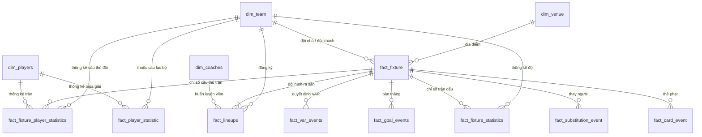

# Football Data Warehouse: ETL, Machine Learning & Analytics System

Dự án Xây dựng Kho dữ liệu Bóng đá (Football Data Warehouse) hoàn chỉnh bao gồm các giai đoạn: **Trích xuất (Extract)**, **Biến đổi & Xác thực (Transform & Validate)**, **Nạp dữ liệu (Load)** vào cơ sở dữ liệu phân tích **ClickHouse**, thiết lập hệ thống điều phối tự động bằng **Apache Airflow**, huấn luyện mô hình **Machine Learning (XGBoost)** dự đoán tỷ số và trực quan hóa dữ liệu trên **Power BI**.

---

## Kiến trúc Tổng thể Hệ thống

Luồng xử lý dữ liệu và vận hành hệ thống diễn ra theo mô hình khép kín dưới đây:

```text
       ┌────────────────────────┐
       │   API-Football API     │  (Nguồn dữ liệu thô)
       └───────────┬────────────┘
                   │  [Extract]
                   ▼
       ┌────────────────────────┐
       │     etl/output/        │  (Raw JSON Files)
       └───────────┬────────────┘
                   │  [Transform & Validate] (Jupyter / Papermill)
                   ▼
       ┌────────────────────────┐
       │       database/        │  (Cleaned JSON Files)
       └───────────┬────────────┘
                   │  [Load]
                   ▼
       ┌────────────────────────┐
       │   ClickHouse Database  │  (Data Warehouse - Columnar Store)
       └─────┬────────────┬─────┘
             │            │
   [Analyze] │            │ [Predict Features]
             ▼            ▼
 ┌───────────────┐   ┌───────────────────────────┐
 │   Power BI    │   │ Machine Learning Model    │
 │ Visualization │   │ (XGBoost + Feature Eng.)  │
 └───────────────┘   └────────────┬──────────────┘
                                  │ [Inference]
                                  ▼
                     ┌───────────────────────────┐
                     │    Tkinter GUI Demo       │  (Giao diện dự đoán)
                     │       (demo.py)           │
                     └───────────────────────────┘
```

Hệ thống được điều phối và lên lịch tự động bởi **Apache Airflow** trong môi trường **Docker Compose**.

---

## Cấu trúc Thư mục Dự án

```text
HQTCSDL/
├── airflow/                   # Cấu hình và điều phối Apache Airflow
│   └── dags/
│       └── football_etl_dag.py # Airflow DAG (TaskFlow API) chạy hàng ngày
│
├── database/                  # Định nghĩa schema và lưu trữ dữ liệu sạch (Cleaned data)
│   ├── INIT_DATABASE_CLICKHOUSE.txt # Script SQL khởi tạo các bảng ClickHouse
│   └── *.json                 # Các file dữ liệu sạch sau khi biến đổi
│
├── etl/                       # Pipeline xử lý ETL chính
│   ├── extract/               # Code trích xuất dữ liệu từ API-Football
│   │   ├── api_client.py
│   │   ├── config.py
│   │   └── extract_*.py       # Trích xuất teams, fixtures, players, lineups, v.v.
│   ├── output/                # Lưu trữ file JSON thô (Raw responses)
│   ├── transform/             # Notebooks làm sạch và biến đổi dữ liệu
│   │   └── transform_*.ipynb  # Làm sạch, chuẩn hóa schema, xử lý giá trị khuyết
│   └── load/                  # Code nạp dữ liệu sạch vào ClickHouse
│       └── load_*.py          # Kết nối ClickHouse và nạp từng bảng dữ liệu
│
├── models/                    # Mô hình Machine Learning dự đoán tỷ số
│   ├── Train_4_model.ipynb    # Phân tích & thử nghiệm huấn luyện mô hình
│   └── v2/                    # Source code mô hình chuẩn hóa phiên bản 2
│       ├── config.py          # Cấu hình tính năng & tham số huấn luyện
│       ├── data_loader.py     # Đọc dữ liệu từ database/json phục vụ ML
│       ├── feature_engineering.py # Trích xuất chỉ số phong độ, Rest Days, H2H...
│       ├── predict_match.py   # Engine dự đoán trận đấu mới
│       ├── train_model.py     # Huấn luyện XGBoost Regressor tối ưu bởi Optuna
│       ├── utils.py
│       └── saved_model/       # Lưu trữ mô hình (.pkl) sau khi huấn luyện
│
├── power_bi/                  # Báo cáo trực quan hóa dữ liệu phân tích
│   └── premier_league.pbix    # File báo cáo Power BI Desktop
│
├── demo.py                    # Ứng dụng GUI Tkinter dự đoán tỷ số trực quan
├── docker-compose.yaml        # Khởi chạy cụm Airflow (Scheduler, Worker, Webserver, PostgreSQL, Redis)
├── Dockerfile                 # Dockerfile build Airflow image cài đặt dependencies bổ sung
└── requirements.txt           # Thư viện Python yêu cầu cho dự án
```

---

## Thiết kế Cơ sở Dữ liệu & Sơ đồ ERD

Cơ sở dữ liệu lưu trữ dưới dạng **Star Schema (Sơ đồ hình sao)** trong **ClickHouse** sử dụng cơ chế `MergeTree` Engine để tối ưu hóa hiệu năng truy vấn phân tích (OLAP).

### Sơ đồ ERD (Entity Relationship Diagram)



### Các bảng chính trong Database

1. **Dimension Tables (Bảng chiều)**:
   - `dim_team`: Thông tin câu lạc bộ (ID, tên, năm thành lập, mã code, logo).
   - `dim_venue`: Thông tin sân vận động (địa chỉ, thành phố, sức chứa, hình ảnh).
   - `dim_players`: Thông tin chi tiết cầu thủ (ngày sinh, quốc tịch, chiều cao, cân nặng).
   - `dim_coaches`: Thông tin huấn luyện viên.
2. **Fact Tables (Bảng sự kiện)**:
   - `fact_fixture`: Lịch thi đấu và kết quả cốt lõi (tỷ số, trọng tài, vòng đấu).
   - `fact_lineups`: Đội hình và sơ đồ chiến thuật của hai đội trong mỗi trận.
   - `fact_fixture_statistics`: Thống kê trận đấu (kiểm soát bóng, dứt điểm, phạt góc, thẻ phạt, xG).
   - `fact_fixture_player_statistics`: Chỉ số chi tiết của từng cầu thủ tham gia trận đấu (phút thi đấu, điểm số đánh giá, bàn thắng, kiến tạo, tắc bóng).
   - `fact_player_statistic`: Thống kê tổng hợp của cầu thủ qua từng mùa giải.
   - `fact_goal_events`, `fact_card_event`, `fact_substitution_event`, `fact_var_events`: Các sự kiện chi tiết thời gian thực diễn ra trên sân.
   - `head_to_head`: Lịch sử đối đầu trực tiếp giữa các cặp đội bóng.

---

## Luồng Pipeline xử lý dữ liệu (ETL & Orchestration)

Luồng ETL tự động hóa thông qua **Apache Airflow** sử dụng mô hình **TaskFlow API** và kỹ thuật **Short-Circuit** để kiểm tra tính toàn vẹn dữ liệu trước khi chuyển tiếp giai đoạn.

### 1. Trích xuất (Extract)
- Sử dụng API client gửi request đến **API-Football**.
- Hỗ trợ rate limit, xử lý lỗi kết nối và ghi logs tự động.
- Dữ liệu thô tải về lưu dưới dạng JSON trong thư mục `etl/output/`.

### 2. Biến đổi & Xác thực (Transform & Validate)
- Sử dụng thư viện **Pandas** trong Jupyter Notebooks để xử lý dữ liệu:
  - Làm phẳng (Flatten) cấu trúc JSON lồng nhau.
  - Loại bỏ các cột trùng lặp, xử lý các giá trị khuyết (`NaN`).
  - Định dạng chuẩn các trường thời gian và kiểu dữ liệu.
- **Xác thực dữ liệu (Validate)**: Giai đoạn trung gian quan trọng được thực thi trong Airflow Dag:
  - `validate_extract`: Đọc file raw JSON, kiểm tra nếu rỗng hoặc lỗi cú pháp thì dừng ngay pipeline (Short-Circuit).
  - `validate_transform`: Sau khi Notebook xử lý xong, tiến hành kiểm tra số lượng bản ghi sạch tại thư mục `database/` trước khi tiến hành nạp.

### 3. Nạp (Load)
- Kết nối tới **ClickHouse** qua thư viện `clickhouse-connect`.
- Tạo cơ sở dữ liệu và các bảng (nếu chưa tồn tại) theo cấu trúc lưu trữ cột.
- Thực hiện bulk insert dữ liệu sạch từ JSON vào cơ sở dữ liệu tối ưu hóa tốc độ nạp.

---

## Mô hình Machine Learning (Predictive Engine)

Hệ thống ML dự đoán số bàn thắng của Đội nhà (`home_goals`) và Đội khách (`away_goals`) bằng mô hình hồi quy **XGBoost Regressor**.

### Trích xuất đặc trưng (Feature Engineering)
Hệ thống sinh ra bộ đặc trưng thông minh từ lịch sử trận đấu:
- **Phong độ gần đây (Recent Form)**: Điểm trung bình bàn thắng ghi được/thủng lưới, tỉ lệ thắng trong 3, 5, 10 trận gần nhất.
- **Lịch sử đối đầu (Head-to-head)**: Kết quả đối đầu trực tiếp gần đây giữa 2 đội.
- **Yếu tố sân nhà/sân khách (Home/Away specialization)**: Phong độ riêng biệt khi đá trên sân nhà hoặc đi sân khách.
- **Số ngày nghỉ (Rest Days)**: Chênh lệch số ngày nghỉ giữa 2 trận đấu gần nhất của mỗi đội (Momentum & Thể lực).
- **Thống kê nâng cao**: Chỉ số thẻ phạt, số cơ hội tạo ra từ dữ liệu sự kiện (`event_features`).

### Huấn luyện & Tuning mô hình
- Sử dụng phương pháp chia tập dữ liệu **TimeSeriesSplit** để tránh rò rỉ dữ liệu tương lai (Data Leakage).
- Tối ưu siêu tham số tự động với **Optuna (Tree-structured Parzen Estimator - TPE)** để tìm ra các tham số `n_estimators`, `max_depth`, `learning_rate`, `subsample` tốt nhất.
- Lưu trữ model đã huấn luyện, scaler chuẩn hóa và danh sách đặc trưng dưới dạng pickle (`.pkl`) trong thư mục `models/v2/saved_model/`.

---

## Ứng dụng Tkinter GUI Demo

Ứng dụng desktop xây dựng trên thư viện `tkinter` (`demo.py`) cung cấp giao diện trực quan cho người dùng cuối:
- **Chọn Đội bóng**: Tự động lọc và gợi ý tên các câu lạc bộ có sẵn trong database.
- **Chọn Ngày thi đấu**: Tính toán phong độ của đội bóng tính đến đúng thời điểm được chọn.
- **Kết quả Dự đoán**: Hiển thị tỉ số dự đoán, Đội thắng cuộc kèm theo **Độ tin cậy (%)** của mô hình.
- **Thống kê Lịch sử**: Hiển thị bảng tổng hợp kết quả 5 trận đối đầu gần nhất của hai đội kèm theo tỉ lệ tài xỉu (Over 2.5), tỉ lệ hai đội đều ghi bàn (BTTS).

---

## Trực quan hóa dữ liệu (Visualization)

Báo cáo **Power BI** (`power_bi/premier_league.pbix`) kết nối trực tiếp với **ClickHouse** cung cấp các góc nhìn phân tích sâu:
- **Bảng xếp hạng thông minh**: Tự động cập nhật thứ hạng các đội dựa trên kết quả trận đấu thực tế.
- **Thống kê phong độ cầu thủ**: Biểu đồ so sánh số bàn thắng, kiến tạo, điểm đánh giá trung bình của các cầu thủ theo mùa giải.
- **Phân tích chiến thuật**: So sánh sơ đồ thi đấu phổ biến của các huấn luyện viên và hiệu quả tương ứng.
- **Chỉ số xG vs Bàn thắng thực tế**: Đánh giá độ hiệu quả của hàng công các đội bóng.

---

## Hướng dẫn Cài đặt & Vận hành

### Chuẩn bị
- Đã cài đặt Docker và Docker Compose.
- Python version 3.10+ (nếu chạy local không qua Docker).

### Bước 1: Khởi chạy môi trường Airflow & Database
Khởi động container cho cụm dịch vụ Airflow, PostgreSQL, Redis:
```bash
docker-compose up -d --build
```
*Giao diện Airflow Webserver sẽ sẵn sàng tại địa chỉ `http://localhost:8080` (Tài khoản mặc định: `airflow` / `airflow`).*

### Bước 2: Khởi tạo ClickHouse Database
Đảm bảo bạn đã cài đặt ClickHouse trên hệ thống local hoặc chạy container ClickHouse. Chạy toàn bộ lệnh SQL trong file:
[INIT_DATABASE_CLICKHOUSE.txt](file:///c:/Users/7610/OneDrive/Dokumen/HQTCSDL/database/INIT_DATABASE_CLICKHOUSE.txt)
để tạo cơ sở dữ liệu `football` cùng toàn bộ 14 bảng cấu trúc.

### Bước 3: Chạy Pipeline ETL
Bạn có thể kích hoạt DAG `football_etl_pipeline` trực tiếp trên giao diện Airflow để thực thi tự động.
Hoặc chạy thủ công qua dòng lệnh bằng Python:
```bash
# Cài đặt thư viện
pip install -r requirements.txt

# Chạy trích xuất dữ liệu thô
python etl/extract/extract_teams.py
python etl/extract/extract_fixtures.py

# Nạp dữ liệu vào ClickHouse
python etl/load/load_team_data.py
python etl/load/load_fixture_data.py
```

### Bước 4: Huấn luyện Mô hình Machine Learning
Để huấn luyện mô hình và lưu lại trọng số dự đoán mới nhất:
```bash
python models/v2/train_model.py
```
*Quá trình này sẽ thực hiện tối ưu hóa siêu tham số bằng Optuna và xuất kết quả lưu trữ vào thư mục `models/v2/saved_model/`.*

### Bước 5: Chạy Ứng dụng Dự đoán (GUI)
Khởi chạy ứng dụng dự đoán tỷ số trận đấu:
```bash
python demo.py
```

---

## Kế hoạch Phát triển Tương lai
- **Real-time Pipeline**: Tích hợp Apache Kafka để truyền và nạp dữ liệu sự kiện trận đấu theo thời gian thực (Live-match events).
- **Deep Learning Model**: Thử nghiệm các kiến trúc mạng nơ-ron LSTM/RNN để dự đoán diễn biến trận đấu dựa trên chuỗi thời gian chi tiết hơn.
- **MLOps**: Tích hợp MLflow để quản lý vòng đời mô hình và giám sát độ lệch dữ liệu (Data Drift).
